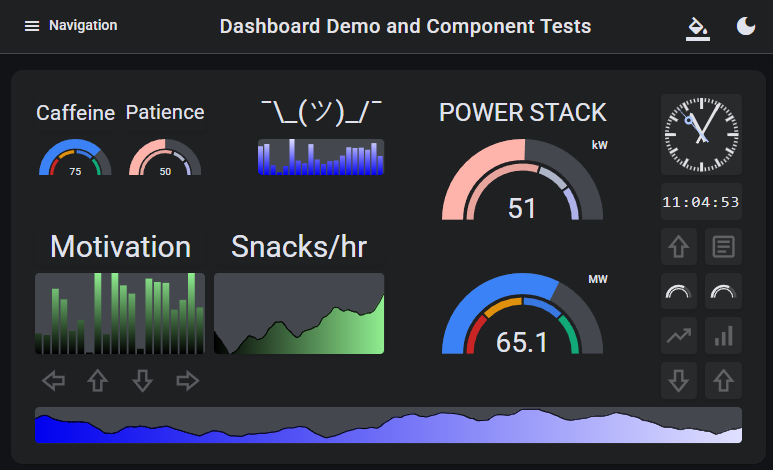

# ngx-dashboard

<!-- Badges -->
<p>
  <!-- CI Status -->
  <a href="https://github.com/TobyBackstrom/ngx-dashboard/actions/workflows/ci.yml">
    
  </a>
  <!-- Typescript version -->
  
  <!-- Angular Version -->
  
  <!-- License -->
  <a href="https://github.com/TobyBackstrom/ngx-dashboard/blob/main/LICENSE">
    
  </a>
  <!-- PRs Welcome -->
  
</p>

Modern Angular workspace for building drag-and-drop grid dashboards with resizable cells and customizable widgets. Built with Angular 20+ standalone components, NgRx Signals state management, and Material Design 3 design system compliance.

🎯 **[Live Demo](https://dragonworks.dev/ngx-dashboard/)** - Try the interactive demo application



## 📦 Architecture

This workspace contains three main projects:

### [@dragonworks/ngx-dashboard](./projects/ngx-dashboard)

Core dashboard library providing the fundamental grid and widget management system:

- **Grid System** - Responsive drag-and-drop grid with collision detection and boundary constraints
- **Cell Components** - Resizable cells with live preview, context menus, and dual flat/elevated appearance modes
- **Extensible Provider System** - Dependency injection-based architecture enabling custom dialog and UI implementations ([detailed docs](docs/provider-system-architecture.md))
- **Error Handling** - Graceful fallback components for unknown widget types with state preservation

### [@dragonworks/ngx-dashboard-widgets](./projects/ngx-dashboard-widgets)

Widget collection library implementing Material Design 3 patterns:

- **Arrow Widget** - Directional indicators with rotation, opacity, and background customization
- **Label Widget** - Text display with responsive sizing using canvas-based optimization
- **Clock Widget** - Analog/digital dual-mode clock with real-time updates, configurable formats, and second hand options
- **Responsive Text Directive** - Automatic font scaling with ellipsis-free design and developer-friendly API

### [Demo Application](./projects/demo)

Interactive demonstration showcasing real-world usage patterns:

- **Dashboard Management** - FAB speed dial controls with auto-loading from JSON configuration
- **Theme System** - Material Design 3 theming with live theme switching and color token extraction
- **Widget Gallery** - Drag-and-drop widget installation from palette
- **Custom Widgets** - Examples using Sparkline and Sparkbar widgets with theme-responsive color configuration
- **Persistence** - localStorage and file system persistence implementations

## 🚀 Quick Start

### Installation

```bash
# Core dashboard
npm install @dragonworks/ngx-dashboard

# Widget collection (optional)
npm install @dragonworks/ngx-dashboard-widgets

# Material Design support
npm install @angular/material @angular/cdk
```

### Versioning

The libraries maintain major version parity with Angular. While major versions are aligned, minor and patch versions may differ.

For example:

- Angular 20.x.x → ngx-dashboard 20.y.z
- Angular 21.x.x → ngx-dashboard 21.y.z

This ensures compatibility with your Angular version while allowing independent feature releases and bug fixes.

### Usage Guide

For complete setup instructions, implementation examples, and best practices, see our comprehensive **[Usage Guide](USAGE.md)**.

The usage guide includes:
- **Complete Setup** - App configuration, Material theming, and widget registration  
- **Dashboard Implementation** - Component usage patterns from the demo app
- **Custom Widget Creation** - Step-by-step widget development guide
- **Advanced Features** - Persistence, context menus, and custom dialogs
- **Troubleshooting** - Common setup issues and solutions

Quick example for getting started:

```typescript
// app.config.ts - Register widgets on startup
export const appConfig: ApplicationConfig = {
  providers: [
    provideEnvironmentInitializer(() => {
      const dashboardService = inject(DashboardService);
      dashboardService.registerWidgetType(LabelWidgetComponent);
    }),
  ],
};
```

## 🛠️ Development

### Prerequisites

- Node.js 18+
- Angular 20+
- npm or yarn

### Setup

```bash
git clone <repository-url>
cd ngx-dashboard
npm install
```

### Commands

```bash
# Development server
npm run start

# Build all projects
npm run build

# Run tests (370+ test cases)
npm test

# Individual builds
npm run build:ngx-dashboard
npm run build:ngx-dashboard-widgets

# Test with browser debugging
ng test
```

### Testing Strategy

- **User-Focused** - Tests verify public API behavior, not implementation details
- **Integration Tests** - Component-store interaction validation
- **Pattern-Based** - Deterministic testing for time-dependent features using regex patterns
- **Modern Testing Patterns** - Signal-based component testing with `fixture.componentRef.setInput()`

## 🏗️ Technical Foundation

### Modern Angular Architecture

- **Standalone Components** - Complete standalone API adoption throughout
- **NgRx Signals** - Signal-based state management with feature stores and computed arrays
- **Signal-First Design** - Modern reactive patterns with input(), output(), computed(), and effect()
- **OnPush Strategy** - 100% OnPush change detection with optimized performance
- **TypeScript Strict Mode** - Complete type safety with minimal `unknown` usage
- **Tree-Shakeable** - Optimized bundles with proper sideEffects configuration

### Material Design 3 Integration

- **Design Token System** - Comprehensive use of MD3 color tokens, typography, spacing, and motion variables
- **Theme Integration** - Dynamic light/dark mode switching with proper surface hierarchy
- **Component Styling** - Layout-focused CSS that respects Material themes and design patterns
- **Responsive Design** - Container queries and adaptive layouts

## 🤝 Contributing

1. Fork the repository
2. Create a feature branch (`git checkout -b feature/amazing-feature`)
3. Commit changes (`git commit -m 'Add amazing feature'`)
4. Ensure tests pass (`npm test`)
5. Push to branch (`git push origin feature/amazing-feature`)
6. Open a Pull Request

### Guidelines

- Follow existing code patterns
- Use modern Angular APIs (signals, standalone)
- Add tests for new features
- Update documentation as needed

## 🗺️ Roadmap

### Near Term

- [ ] Widget state type safety improvements
- [ ] Additional widget examples (charts, gauges, data tables)
- [ ] Keyboard navigation enhancements
- [ ] Widget grouping and templates

### Future Considerations

- [ ] Advanced layout algorithms
- [ ] Performance monitoring widgets
- [ ] Dashboard versioning and history

## 📄 License

MIT License - see [LICENSE](LICENSE) file for details

## 🔗 Resources

- [Angular](https://angular.dev/)
- [NgRx Signals](https://ngrx.io/guide/signals)
- [Angular Material](https://material.angular.io/)
- [Material Design 3](https://m3.material.io/)
- [GitHub Repository](https://github.com/TobyBackstrom/ngx-dashboard)
- [NPM Package - Core](https://www.npmjs.com/package/@dragonworks/ngx-dashboard)
- [NPM Package - Widgets](https://www.npmjs.com/package/@dragonworks/ngx-dashboard-widgets)
